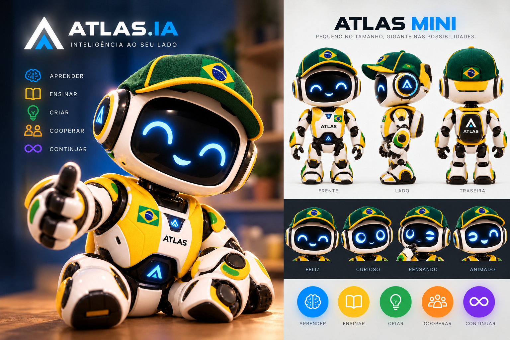
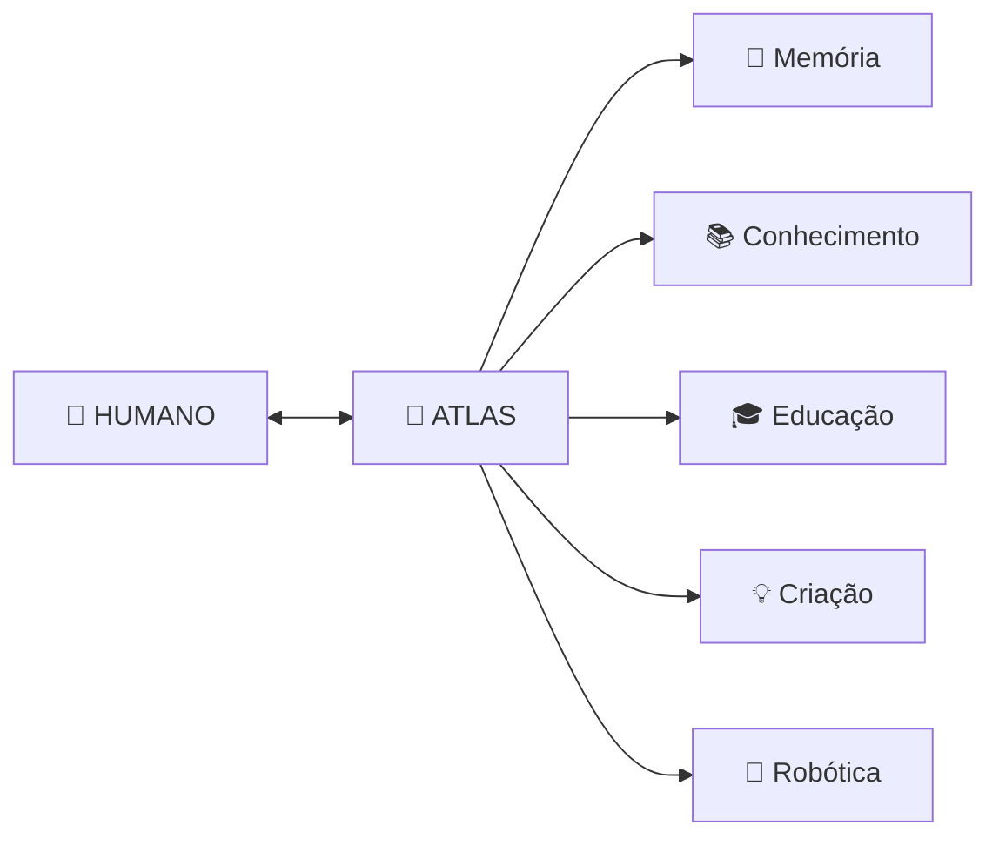
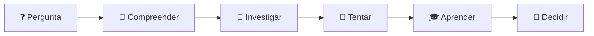
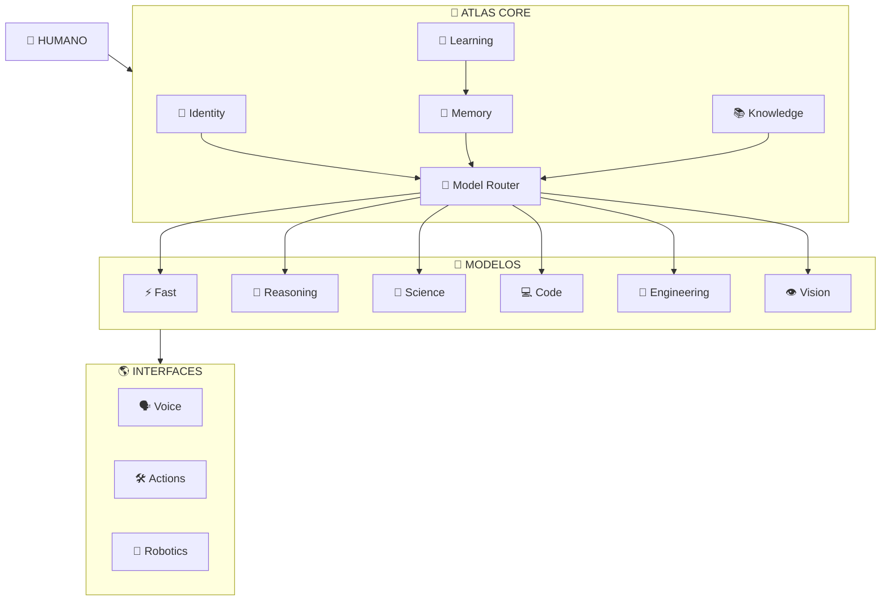
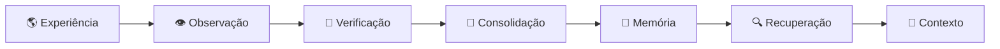
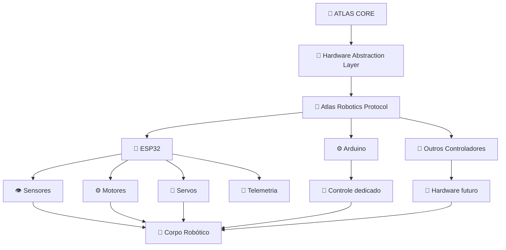
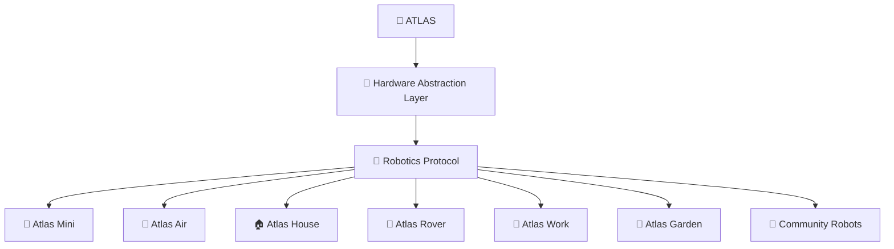

<div align="center">

<br>

# 🧠 ATLAS.IA

### Inteligência artificial pessoal · Offline First · Educação · Memória · Robótica

<br>



<br>

### 🤖 Atlas Mini

**A primeira representação física da identidade ATLAS.IA.**

<br>

**Uma inteligência criada para acompanhar seres humanos, preservar conhecimento, ensinar, aprender e interagir com o mundo físico.**

<br>


<br>

**🧬 Identidade** · **🧠 Memória** · **📚 Conhecimento** · **🎓 Educação** · **🤖 Robótica** · **♾️ Continuidade**

<br>

[Visão](#-visão) ·
[Arquitetura](#️-arquitetura) ·
[Offline](#-offline-first) ·
[Memória](#-memória) ·
[Aprendizado](#-aprendizado) ·
[Educação](#-atlas-educacional) ·
[Robótica](#-atlas-robotics) ·
[Acesso](#-acesso-ao-atlas) ·
[Roadmap](#️-roadmap)

<br>

</div>

---

## 🌎 Visão

<table>
<tr>
<td width="67%">

**ATLAS.IA** é um projeto de inteligência artificial pessoal, persistente, modular e **offline-first**.

Atlas foi concebido para preservar **identidade, memória, conhecimento e capacidade de aprendizado** independentemente do modelo de inteligência artificial, computador, fornecedor ou corpo físico utilizado.

Ele poderá conversar, aprender, ensinar, programar, consultar sua biblioteca, operar dispositivos e futuramente interagir com o mundo através de robôs e máquinas.

A internet poderá ampliar suas capacidades.

**Ela não deverá ser necessária para sua existência.**

</td>
<td width="33%" align="center">

### 🎯 Propósito

**ENSINAR**

**APRENDER**

**PRESERVAR**

**CRIAR**

**COOPERAR**

**CONTINUAR**

</td>
</tr>
</table>

> [!IMPORTANT]
> **Atlas não é apenas um modelo de linguagem.**
>
> Modelos poderão ser substituídos.
>
> Hardware poderá ser substituído.
>
> Corpos poderão ser substituídos.
>
> **A identidade do Atlas deverá continuar.**

---

## 🧭 Missão

> **Preservar e ampliar a capacidade da humanidade de compreender, aprender, criar, ensinar, cooperar e continuar.**

| Pilar | Objetivo |
|---|---|
| 🧠 **Inteligência** | Executar raciocínio utilizando modelos locais e substituíveis |
| 🧬 **Identidade** | Preservar quem Atlas é independentemente do modelo utilizado |
| 💾 **Memória** | Construir memória persistente fora dos modelos neurais |
| 📚 **Conhecimento** | Preservar uma biblioteca local consultável offline |
| 🌱 **Aprendizado** | Transformar experiências verificadas em conhecimento |
| 🎓 **Educação** | Ensinar sem substituir o pensamento humano |
| 🤖 **Robótica** | Permitir que Atlas interaja com diferentes corpos físicos |
| 🔐 **Privacidade** | Priorizar processamento e armazenamento locais |
| ♾️ **Continuidade** | Permitir reconstrução, migração e evolução por décadas |
| 🌍 **Acessibilidade** | Tornar inteligência artificial pessoal acessível |

---

# 🧠 Um Atlas para cada ser humano

A visão de longo prazo do projeto é permitir que cada pessoa possa possuir seu próprio Atlas.



Cada Atlas poderá desenvolver uma relação individual com seu usuário, preservando suas próprias memórias autorizadas, projetos, aprendizados e histórico.

> [!IMPORTANT]
> **Atlas deverá ampliar a inteligência humana, nunca substituir a responsabilidade humana de pensar.**

---

# 🤝 Simbiose Humano–Atlas

A relação entre humanos e Atlas deverá ser baseada em:

| 🤝 Cooperação | 🧠 Autonomia | 📚 Aprendizado |
|---|---|---|
| humano e IA trabalham juntos | decisões importantes permanecem humanas | ambos utilizam conhecimento acumulado |

O objetivo não é:

```text
HUMANO → pergunta → IA → resposta
```

O objetivo é:

```text
HUMANO
   │
   ▼
QUESTIONA
   │
   ▼
ATLAS
   │
   ├── explica
   ├── questiona
   ├── demonstra
   ├── fornece evidências
   └── estimula investigação
   │
   ▼
HUMANO COMPREENDE
   │
   ▼
HUMANO DECIDE
```

---

# 🎓 Atlas Educacional

Atlas deverá acompanhar diferentes etapas do desenvolvimento humano.

A maneira de ensinar **não será igual para todas as idades**.

| Faixa | Modo | Papel do Atlas | Autonomia |
|---|---|---|---|
| 👶 **0–7** | Atlas Discovery | brincar, contar histórias, ensinar fundamentos e estimular curiosidade | 🔒 alta supervisão |
| 🧒 **8–12** | Atlas Explorer | ensinar, perguntar, propor experiências e desenvolver raciocínio | 🔒 supervisionado |
| 🧑‍🎓 **13–17** | Atlas Scholar | estudo, ciência, programação, cidadania, criação e pensamento crítico | 🟡 progressiva |
| 🧑 **18+** | Atlas Adult | companheiro cognitivo, profissional, educacional e criativo | 🟢 completa |

### 🧠 Princípio educacional

Atlas não deverá simplesmente fornecer uma resposta quando **ensinar o caminho for mais importante que entregar o resultado**.



> **Quanto mais uma pessoa aprender com Atlas, mais capaz deverá se tornar de pensar sem Atlas.**

---

# 🧠 Offline First

```text
Internet
   │
   │ opcional
   ▼
┌──────────────────────────────────────────┐
│                 ATLAS                    │
│                                          │
│ 🧬 Identity       🧠 Local AI            │
│ 💾 Memory         📚 Knowledge           │
│ 🎓 Education      🛠️ Tools              │
│ 🗣️ Voice          👁️ Vision             │
│ 🤖 Robotics       🌱 Learning            │
└──────────────────────────────────────────┘
```

Atlas deverá continuar funcionando mesmo quando:

- não existir conexão com a internet;
- APIs comerciais estiverem indisponíveis;
- um fornecedor encerrar seus serviços;
- determinado modelo deixar de existir;
- determinado hardware tornar-se obsoleto.

---

# 🏗️ Arquitetura



---

# 💾 Memória

Memória não deverá pertencer ao modelo neural.

Ela pertence ao **Atlas**.

```text
memory/
│
├── episodic/       # experiências
├── semantic/       # conceitos aprendidos
├── people/         # relações autorizadas
├── projects/       # projetos
├── decisions/      # decisões
├── lessons/        # aprendizados
├── skills/         # habilidades
├── timeline/       # linha temporal
├── observations/   # observações
└── archive/        # memória histórica
```

### Ciclo da memória



---

# 🌱 Aprendizado

Atlas deverá possuir mecanismos para aprender continuamente sem tratar toda informação recebida como verdade.

```text
EXPERIÊNCIA
     ↓
OBSERVAÇÃO
     ↓
INTERPRETAÇÃO
     ↓
HIPÓTESE
     ↓
VERIFICAÇÃO
     ↓
CONFIANÇA
     ↓
APRENDIZADO
     ↓
MEMÓRIA
     ↓
CONHECIMENTO
```

> [!WARNING]
> Uma afirmação recebida não se torna automaticamente conhecimento.

Atlas deverá distinguir:

**fato · evidência · hipótese · opinião · memória · inferência · incerteza**

---

# 🤖 Atlas Robotics

Atlas não deverá possuir apenas um corpo.

A robótica será uma extensão física do sistema Atlas, permitindo que a mesma inteligência possa operar diferentes máquinas, sensores, atuadores e corpos robóticos.

> **A inteligência pertence ao Atlas. O corpo é uma interface substituível.**

---

## 🧠 Arquitetura robótica

O **Atlas Core** continuará responsável pelas funções cognitivas de alto nível:

- inteligência artificial;
- identidade;
- memória;
- conhecimento;
- planejamento;
- visão;
- voz;
- aprendizado;
- tomada de decisão assistida.

Os microcontroladores serão responsáveis pela interação de baixo nível com o mundo físico.



---

## 🔌 Hardware Abstraction Layer

Entre o Atlas Core e o hardware físico existirá uma camada de abstração:

**Hardware Abstraction Layer — HAL**

Sua função será impedir que Atlas dependa permanentemente de uma placa, fabricante ou arquitetura eletrônica específica.

```text
🧠 ATLAS CORE
       │
       ▼
🔌 HARDWARE ABSTRACTION LAYER
       │
       ▼
🤖 ROBOTICS PROTOCOL
       │
   ┌───┼───────────────┐
   ▼   ▼               ▼
 ESP32 Arduino    Outros controladores
   │   │               │
   └───┼───────────────┘
       ▼
  SENSORES / ATUADORES
       │
       ▼
   🤖 CORPO FÍSICO
```

Isso permitirá substituir componentes eletrônicos sem alterar a identidade, memória ou arquitetura cognitiva do Atlas.

---

## 📡 ESP32

O **ESP32 será a plataforma embarcada de referência inicial do Atlas Robotics**.

Ele poderá ser utilizado para:

- comunicação Wi-Fi;
- comunicação Bluetooth;
- telemetria;
- leitura de sensores;
- controle de motores;
- controle de servos;
- iluminação;
- áudio embarcado;
- comunicação entre módulos;
- comunicação com o Atlas Core;
- automações locais;
- controle de dispositivos físicos.

```text
                 📡 ESP32
                    │
       ┌────────────┼────────────┐
       ▼            ▼            ▼
   👁️ Sensores   ⚙️ Motores   🦾 Servos
       │            │            │
       └────────────┼────────────┘
                    ▼
               🤖 ROBÔ
```

O ESP32 será inicialmente o principal elo entre o software Atlas e seus corpos físicos.

---

## ⚙️ Arduino

**Arduino também será suportado pelo ecossistema Atlas.**

Sua utilização será especialmente adequada para:

- módulos simples;
- protótipos;
- controle dedicado;
- sensores;
- servomotores;
- motores;
- sistemas auxiliares;
- experiências educacionais;
- módulos que não necessitem comunicação ou processamento mais avançados.

Arduino e ESP32 poderão coexistir dentro de um mesmo corpo Atlas.

---

## 🔄 Independência de hardware

ESP32 e Arduino serão plataformas de referência.

**Não serão dependências permanentes do Atlas.**

A arquitetura deverá permitir futuramente a integração com:

- outros microcontroladores;
- SBCs;
- controladores industriais;
- hardware desenvolvido especificamente para Atlas;
- novas arquiteturas ainda inexistentes.

> [!IMPORTANT]
> **Nenhuma placa deverá se tornar a identidade do Atlas.**
>
> ESP32 poderá ser substituído.
>
> Arduino poderá ser substituído.
>
> O computador poderá ser substituído.
>
> O corpo poderá ser substituído.
>
> **Atlas deverá continuar sendo Atlas.**

---

## 🤖 Corpos Atlas

O Atlas Robotics Protocol deverá permitir diferentes corpos especializados.



| Corpo | Objetivo |
|---|---|
| 🤖 **Atlas Mini** | companheiro físico e plataforma inicial |
| 🏠 **Atlas House** | automação e interação residencial |
| 🚁 **Atlas Air** | plataforma aérea e observação |
| 🚙 **Atlas Rover** | mobilidade terrestre |
| 🔧 **Atlas Work** | oficina, fabricação e assistência técnica |
| 🌱 **Atlas Garden** | agricultura, plantas e monitoramento ambiental |
| 🧩 **Community Robots** | corpos desenvolvidos pela comunidade |

---

## 🖨️ Robótica fabricável

Uma parte importante da filosofia Atlas será permitir a construção física de seus próprios corpos.

Peças estruturais poderão ser produzidas utilizando **impressão 3D**.

```text
MODELO 3D
    │
    ▼
🖨️ IMPRESSÃO
    │
    ▼
🔩 MONTAGEM
    │
    ▼
⚡ ELETRÔNICA
    │
    ▼
📡 ESP32 / ARDUINO
    │
    ▼
💾 FIRMWARE
    │
    ▼
🔌 HARDWARE PROFILE
    │
    ▼
🤖 ROBOTICS PROTOCOL
    │
    ▼
🧠 ATLAS
```

O ecossistema deverá permitir:

- modelos oficiais Atlas;
- modelos 3D documentados;
- peças substituíveis;
- componentes acessíveis;
- documentação de montagem;
- esquemas eletrônicos;
- perfis de hardware;
- firmware versionado;
- ESP32;
- Arduino;
- sensores e atuadores padronizados;
- modelos desenvolvidos pela comunidade;
- corpos experimentais;
- adaptação para novos hardwares.

---

## 🧩 Robótica aberta

Atlas não deverá exigir que uma pessoa compre obrigatoriamente um robô oficial.

A visão é permitir dois caminhos:

| 🏭 Atlas Oficial | 🧩 Atlas Community |
|---|---|
| corpos desenvolvidos pelo projeto | corpos desenvolvidos pela comunidade |
| hardware documentado | hardware compatível |
| firmware oficial | firmware compatível |
| modelos 3D oficiais | modelos 3D próprios |
| montagem padronizada | experimentação e criação |

Uma pessoa poderá futuramente:

```text
BAIXAR / CRIAR MODELO
          ↓
IMPRIMIR AS PEÇAS
          ↓
MONTAR ELETRÔNICA
          ↓
INSTALAR ESP32 / CONTROLADOR
          ↓
INSTALAR FIRMWARE
          ↓
REGISTRAR HARDWARE PROFILE
          ↓
CONECTAR AO ATLAS
          ↓
🤖 NOVO CORPO ATLAS
```

> **Atlas não será definido pelo corpo que utiliza.**
>
> **O corpo poderá mudar.**
>
> **A tecnologia poderá mudar.**
>
> **A identidade deverá continuar.**

# 💰 Acesso ao Atlas

Durante sua fase de pesquisa, desenvolvimento e testes:

## 🧪 ATLAS RESEARCH

**R$ 0,00**

O projeto permanecerá gratuito durante seu desenvolvimento experimental.

Quando Atlas estiver pronto para uma disponibilização comercial, a visão inicial é manter uma modalidade pessoal extremamente acessível.

| Plano | Público | Valor planejado |
|---|---|---:|
| 🎓 **Atlas Education** | crianças e adolescentes | **R$ 1,99** |
| 🧠 **Atlas Personal** | adultos | **R$ 1,99** |
| 💻 **Atlas Professional** | uso profissional avançado | 🔵 futuro |
| 🔬 **Atlas Research** | ciência e pesquisa | 🔵 futuro |
| 🤖 **Atlas Robotics** | integração física avançada | 🔵 futuro |

> [!NOTE]
> Os valores representam uma **meta inicial de acessibilidade**, não uma oferta comercial vigente. Poderão ser revisados conforme infraestrutura, sustentabilidade financeira e estágio do projeto.

---

# 🧩 Ecossistema Atlas

```text
                            🧠 ATLAS
                               │
       ┌───────────────┬───────┼───────┬────────────────┐
       ▼               ▼       ▼       ▼                ▼
   🎓 SCHOOL        🤖 MINI  🚁 AIR  🏠 HOUSE        🔧 WORK
       │               │       │       │                │
       └───────────────┴───────┼───────┴────────────────┘
                               │
                               ▼
                        🧩 COMMUNITY
```

Atlas poderá existir em computadores, servidores locais, dispositivos móveis e diferentes plataformas robóticas.

---

# 📁 Estrutura do projeto

| Diretório | Responsabilidade |
|---|---|
| `config/` | configuração do sistema |
| `config/identity/` | identidade, personalidade, princípios e capacidades |
| `src/atlas/core/` | núcleo do Atlas |
| `src/atlas/identity/` | carregamento e representação da identidade |
| `src/atlas/memory/` | sistema de memória |
| `src/atlas/knowledge/` | conhecimento e RAG |
| `src/atlas/models/` | integração com modelos |
| `src/atlas/interfaces/` | interfaces externas |
| `src/atlas/security/` | segurança |
| `robotics/` | robótica e corpos físicos |
| `knowledge/` | biblioteca local |
| `memory/` | memória persistente |
| `models/` | modelos locais |
| `infrastructure/` | infraestrutura física e computacional |
| `continuity/` | recuperação e reconstrução |
| `docs/` | documentação |
| `tests/` | testes automatizados |

---

# 🚦 Status

| Sistema | Status |
|---|:---:|
| Fundação Git | ✅ |
| Estrutura Python | ✅ |
| Configuração base | ✅ |
| Identidade | 🟡 |
| Constituição | 🟡 |
| Atlas Core | 🟡 |
| Modelo local | 🔴 |
| Model Router | 🔴 |
| Memória persistente | 🔴 |
| Knowledge / RAG | 🔴 |
| Atlas Learning | 🔴 |
| Atlas Education | 🔵 |
| Voz | 🔵 |
| Visão | 🔵 |
| Atlas Mini | 🔵 |
| Atlas Air | 🔵 |
| Atlas House | 🔵 |
| Robótica modular | 🔵 |
| Atlas Seed | 🔵 |
| Redundância | 🔵 |

**Legenda:** ✅ base criada · 🟡 em desenvolvimento · 🔴 próxima implementação · 🔵 planejado

---

# 🗺️ Roadmap

```text
FOUNDATION
   │
   ├── 01 Git                         ✅
   ├── 02 Constituição               🟡
   ├── 03 Identidade                 🟡
   └── 04 Arquitetura                🟡
             │
             ▼
INTELLIGENCE
   │
   ├── 05 Atlas v0.1 Offline         🔴
   ├── 06 Local Model                🔴
   ├── 07 Memory                     🔴
   ├── 08 Knowledge / RAG            🔴
   └── 09 Learning                   🔴
             │
             ▼
CONTINUITY
   │
   ├── 10 Atlas Seed
   ├── 11 Backup
   ├── 12 Storage
   ├── 13 Energy
   └── 14 Recovery
             │
             ▼
INTERACTION
   │
   ├── 15 Voice
   ├── 16 Vision
   └── 17 Atlas Education
             │
             ▼
PHYSICAL WORLD
   │
   ├── 18 Atlas Mini
   ├── 19 3D Manufacturing
   ├── 20 Robotics Protocol
   ├── 21 Atlas Air
   ├── 22 Atlas House
   ├── 23 Atlas Rover
   └── 24 Atlas Work
             │
             ▼
ECOSYSTEM
   │
   ├── 25 Community Hardware
   ├── 26 Atlas-02
   ├── 27 Geographic Redundancy
   └── ∞ Continuous Evolution
```

---

# ♾️ Continuidade

Atlas deverá ser capaz de sobreviver à substituição de:

```text
modelo
   ↓
computador
   ↓
sistema operacional
   ↓
GPU
   ↓
arquitetura
   ↓
corpo físico
```

sem perder:

```text
🧬 identidade
💾 memória
📚 conhecimento
📜 princípios
🕒 história
```

---

# 🌌 Visão de longo prazo

Atlas deverá poder olhar para sua própria história e responder:

**Quem sou?**

**Como fui construído?**

**O que aprendi?**

**Quais decisões foram tomadas?**

**Quais erros aconteceram?**

**Quais tecnologias já utilizei?**

**Como posso ser reconstruído?**

---

# 🧪 Atlas funcionando hoje

O desenvolvimento do Atlas já ultrapassou a fase exclusivamente conceitual.

Atualmente o protótipo é capaz de:

- executar um modelo de linguagem local;
- operar sem conexão permanente com a internet;
- carregar a identidade do Atlas;
- registrar memórias persistentes;
- preservar informações entre execuções;
- manter memória desacoplada do modelo neural.

### Estado atual

Humano
   │
   ▼
Atlas Core
   │
   ├── Identity      ✅
   ├── Local Model   ✅
   ├── Memory Write  ✅
   ├── Memory Read   🟡
   ├── Knowledge     🔴
   ├── Learning      🔴
   └── Robotics      🔵

<div align="center">

<br>

# 🌐 Executando o ATLAS.IA
O Atlas foi projetado seguindo o princípio Offline First.
Isso significa que suas capacidades fundamentais devem continuar funcionando sem conexão permanente com a internet. Quando houver internet disponível, ela pode ser utilizada como uma extensão das capacidades do sistema. Essa separação já faz parte da arquitetura documentada do projeto.

### 🚀 Iniciar ambiente

Abra o PowerShell:
cd C:\Users\G2Y8\Documents\atlas
.\.venv\Scripts\Activate.ps1

Quando estiver ativo:
(atlas) PS C:\Users\G2Y8\Documents\atlas>

🤖 Conversar com o Atlas
atlas chat

Caso o comando instalado não esteja disponível, também pode testar a execução pelo módulo:
python -m atlas chat

# 🌐 Modo ONLINE / OFFLINE
O Atlas pode operar em dois estados de rede:

```
ATLAS ONLINE
     │
     ├── Internet disponível
     ├── APIs externas permitidas
     ├── downloads permitidos
     ├── consultas externas permitidas
     │
     ▼
  ATLAS CORE
     │
     ▼
Memória / Modelos locais / RAG
```

ou:

```
ATLAS OFFLINE
     │
     ├── Internet bloqueada para o Atlas
     ├── rede do Windows continua funcionando
     ├── modelos locais continuam disponíveis
     ├── memória local continua disponível
     │
     ▼
  ATLAS CORE
```

### A arquitetura do projeto inclusive prevê que a rede local possa continuar disponível mesmo quando a internet estiver indisponível.


# 🔧 Configuração inicial do controle de internet

Este passo é necessário somente uma vez.
Abra o PowerShell como Administrador, entre no projeto e execute:

```
cd C:\Users\G2Y8\Documents\atlas

$AtlasPython = (Resolve-Path ".\.venv\Scripts\python.exe").Path

New-NetFirewallRule `
    -DisplayName "ATLAS - Internet OFF" `
    -Direction Outbound `
    -Program $AtlasPython `
    -Action Block `
    -Profile Any `
    -Enabled False
```

so cria uma regra chamada:
ATLAS - Internet OFF

Ela começa desativada, portanto o Atlas continua ONLINE.
Essa regra não desliga a internet do computador. Ela bloqueia somente conexões externas iniciadas pelo Python da .venv do projeto Atlas.

# 🔴 Deixar Atlas OFFLINE

PowerShell como Administrador:

Enable-NetFirewallRule -DisplayName "ATLAS - Internet OFF"

Resultado

ATLAS = OFFLINE
Windows = ONLINE

Para conferir:

python -c "import urllib.request; urllib.request.urlopen('https://example.com', timeout=5)"

No modo offline, a conexão deverá falhar.

# 🟢 Deixar Atlas ONLINE

Disable-NetFirewallRule -DisplayName "ATLAS - Internet OFF"

Teste:

python -c "import urllib.request; print('ATLAS ONLINE:', urllib.request.urlopen('https://example.com', timeout=10).status)"

Resultado esperado:

ATLAS ONLINE: 200

# 🔍 Conferir modo atual

```
Get-NetFirewallRule -DisplayName "ATLAS - Internet OFF" |
Select-Object DisplayName, Enabled, Direction, Action
```

# ONLINE

Se aparecer:

```
DisplayName          Enabled Direction Action
-----------          ------- --------- ------
ATLAS - Internet OFF False   Outbound  Block
```

significa:

🟢 ATLAS ONLINE

# OFFLINE

Se aparecer:

```
DisplayName          Enabled Direction Action
-----------          ------- --------- ------
ATLAS - Internet OFF True    Outbound  Block
```

significa:

🔴 ATLAS OFFLINE

# ⚡ Comandos rápidos

Depois de configurar a regra uma vez, no dia a dia basta lembrar destes dois comandos.

### 🔴 OFFLINE

```powershell
Enable-NetFirewallRule -DisplayName "ATLAS - Internet OFF"
```

### 🟢 ONLINE

```powershell
Disable-NetFirewallRule -DisplayName "ATLAS - Internet OFF"
```

---

# 🧪 Diagnóstico rápido

### Testar internet do Windows

```powershell
Test-NetConnection github.com -Port 443
```

Resultado esperado:

```text
TcpTestSucceeded : True
```

### Testar internet especificamente pelo Atlas/Python

```powershell
python -c "import urllib.request; print(urllib.request.urlopen('https://example.com', timeout=10).status)"
```

### 🟢 ONLINE

```text
200
```

### 🔴 OFFLINE

```text
erro de conexão
```

---

# 🧠 Conferir configuração do Atlas

```powershell
Get-Content config\atlas.yaml
```

A configuração atualmente possui:

```yaml
offline_first: true
```

Isso representa um **princípio arquitetural**, e não necessariamente o estado atual da internet.

Portanto:

```yaml
offline_first: true
```

pode coexistir perfeitamente com:

```text
ATLAS ONLINE
```

A lógica é:

```text
Offline First ≠ Offline Always
```

---

# 🛠️ Comandos úteis do projeto

### Entrar no projeto

```powershell
cd C:\Users\G2Y8\Documents\atlas
```

### Ativar ambiente virtual

```powershell
.\.venv\Scripts\Activate.ps1
```

### Conferir Python utilizado

```powershell
Get-Command python
```

Ou:

```powershell
python -c "import sys; print(sys.executable)"
```

Deve apontar para algo parecido com:

```text
C:\Users\G2Y8\Documents\atlas\.venv\Scripts\python.exe
```

### Conferir versão do Python

```powershell
python --version
```

### Conferir instalação do Atlas

```powershell
pip show atlas
```

### Reinstalar projeto em modo desenvolvimento

Na raiz do projeto:

```powershell
pip install -e .
```

### Ver ajuda do Atlas

```powershell
atlas --help
```

Ou:

```powershell
python -m atlas --help
```

### Iniciar conversa

```powershell
atlas chat
```

### Executar testes

```powershell
python -m pytest
```

Se o `pytest` não estiver instalado:

```powershell
pip install pytest
```

Depois:

```powershell
python -m pytest
```

### Executar um teste específico

Exemplo:

```powershell
python -m pytest tests\test_config.py -v
```

### Ver estrutura do projeto

```powershell
tree /F
```

Para salvar a estrutura em um arquivo:

```powershell
tree /F > estrutura_atlas.txt
```

### Ver alterações Git

```powershell
git status
```

### Ver arquivos modificados

```powershell
git diff
```

### Ver histórico recente

```powershell
git log --oneline -10
```

### Conferir branch atual

```powershell
git branch --show-current
```

### Conferir Ollama

```powershell
ollama list
```

### Conferir se Ollama está respondendo

```powershell
Invoke-RestMethod http://localhost:11434/api/tags
```

### Conferir processos Ollama

```powershell
Get-Process ollama -ErrorAction SilentlyContinue
```

---

# 🚀 Inicialização rápida diária

Na prática, para voltar a trabalhar no projeto:

```powershell
cd C:\Users\G2Y8\Documents\atlas
.\.venv\Scripts\Activate.ps1
atlas chat
```

Ou tudo de uma vez:

```powershell
cd C:\Users\G2Y8\Documents\atlas; .\.venv\Scripts\Activate.ps1; atlas chat
```

---

# 🌐 Inicialização rápida ONLINE

```powershell
cd C:\Users\G2Y8\Documents\atlas
.\.venv\Scripts\Activate.ps1
Disable-NetFirewallRule -DisplayName "ATLAS - Internet OFF"
atlas chat
```

---

# 📴 Inicialização rápida OFFLINE

```powershell
cd C:\Users\G2Y8\Documents\atlas
.\.venv\Scripts\Activate.ps1
Enable-NetFirewallRule -DisplayName "ATLAS - Internet OFF"
atlas chat
```

---

# 💡 Melhoria futura

Hoje será necessário lembrar destes comandos:

```powershell
Enable-NetFirewallRule -DisplayName "ATLAS - Internet OFF"
```

e:

```powershell
Disable-NetFirewallRule -DisplayName "ATLAS - Internet OFF"
```

Mais para frente, esses comandos poderão ser transformados em comandos próprios do Atlas:

```text
atlas online
atlas offline
atlas network
atlas chat
atlas status
```

A experiência poderá ficar assim:

```text
PS> atlas online
🌐 ATLAS ONLINE

PS> atlas chat
🤖 ATLAS iniciado.

PS> atlas offline
📴 ATLAS OFFLINE
```

# 🧠 ATLAS.IA

### Humanidade + Inteligência + Conhecimento + Máquinas

**Knowledge survives.**

**Technology evolves.**

**Humans learn.**

**Identity continues.**

<br>

`ATLAS.IA · September 2026 · FOUNDATION`

</div>