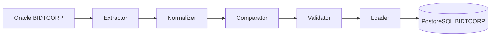
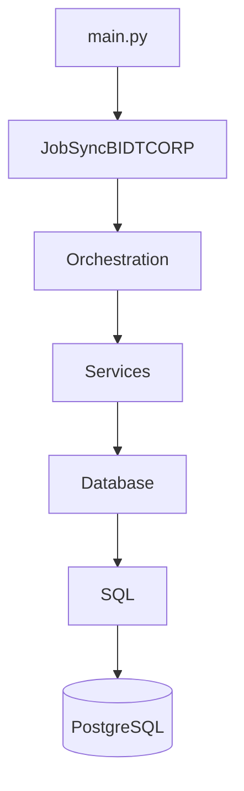
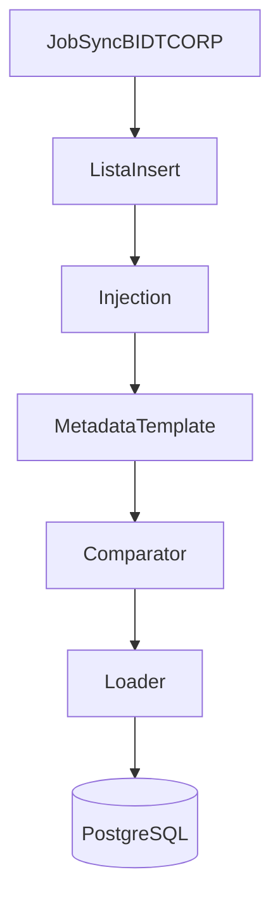
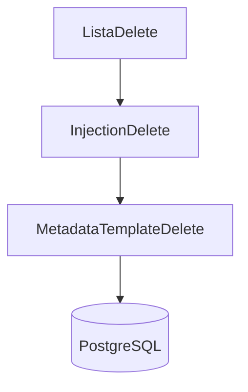
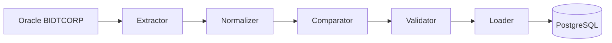
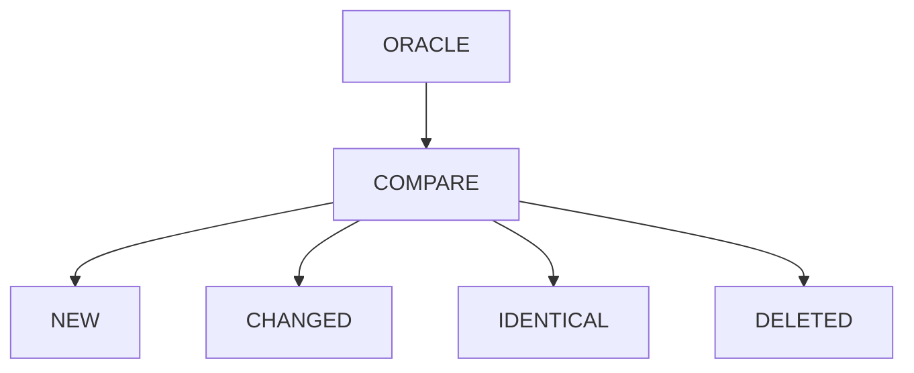
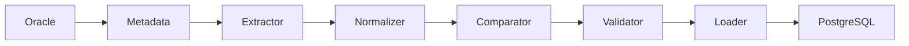
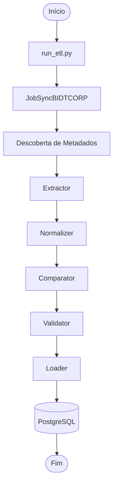

<div align="center">

# 🚀 SyncBIDT Cloud JobSyncBIDTCORP PostgreSQL

### Migração Completa do Processo de Sincronização BIDTCORP

### **Oracle → Python → PostgreSQL**

<br>


<br>

**Engenharia de Dados • ETL • Oracle • PostgreSQL • Python • Jenkins**

---

Migração completa do processo **JobSyncBIDTCORP_Cloud.kjb**, substituindo integralmente a implementação em Pentaho Data Integration por uma arquitetura moderna em Python, preservando todas as regras de sincronização entre Oracle e PostgreSQL e ampliando a rastreabilidade, modularização e facilidade de manutenção do processo.

</div>

---

# 📑 Índice

- 📖 Sobre o Projeto
- 🎯 Objetivos
- 🏗 Arquitetura da Solução
- 🔄 Fluxo Geral da Sincronização
- ✨ Principais Características
- 📂 Estrutura do Projeto
- 📁 Estrutura da Aplicação
- 🧩 Componentes da Arquitetura
- ⚙️ Camada de Serviços
- 🗄 Camada de Banco de Dados
- 📄 Equivalência Pentaho → Python
- 🚀 Execução
- ➡ Funcionamento Interno (Parte 2)

---

# 📖 Sobre o Projeto

O **SyncBIDT Cloud JobSyncBIDTCORP PostgreSQL** é responsável por sincronizar o conteúdo do schema **BIDTCORP** existente no Oracle para o schema **bidtcorp** em PostgreSQL, preservando integralmente a ordem de processamento, relacionamentos entre tabelas e regras de negócio originalmente implementadas no processo Pentaho.

A sincronização realiza automaticamente a descoberta de metadados, identifica diferenças entre origem e destino, classifica registros conforme seu estado e executa apenas as operações necessárias para manter ambas as bases consistentes.

Durante a migração, toda a arquitetura foi reescrita em Python utilizando componentes especializados para extração, normalização, comparação, validação e carga dos dados.

---

# 🎯 Objetivos

A modernização deste processo possui como principais objetivos:

- Eliminar a dependência do Pentaho Data Integration;
- Preservar integralmente a lógica do JobSyncBIDTCORP;
- Automatizar a descoberta de metadados Oracle e PostgreSQL;
- Sincronizar apenas registros realmente modificados;
- Garantir consistência entre origem e destino;
- Facilitar futuras evoluções da sincronização;
- Permitir execução local e automatizada via Jenkins;
- Disponibilizar execução segura através do modo **DRY_RUN**;
- Padronizar futuras migrações de sincronizadores Pentaho para Python.

---

# 🏗 Arquitetura da Solução



---

## Arquitetura em Camadas



Cada camada possui responsabilidade única, permitindo baixo acoplamento, reutilização de código e facilidade de manutenção.

---

# 🔄 Fluxo Geral da Sincronização

O processo executa exatamente a mesma sequência lógica existente no Job Pentaho original.



Fluxo opcional de exclusão:



---

# ✨ Principais Características

| Característica | Descrição |
|----------------|-----------|
| 🐍 Python 3 | Implementação completa em Python |
| 🔄 Sincronização Incremental | Processa apenas registros alterados |
| 📊 Descoberta de Metadados | Identificação automática de tabelas, colunas e chaves |
| ⚙ Comparator | Equivalente ao Merge Rows (Diff) do Pentaho |
| 🧪 DRY_RUN | Execução sem alterar a base de destino |
| 🔒 Controle de Constraints | Remoção e recriação automática da FK necessária |
| 📋 Logs Estruturados | Rastreabilidade completa da execução |
| 🚀 Jenkins Ready | Preparado para execução automatizada |

---

# 📂 Estrutura do Projeto

```text
SyncBIDT_Cloud_JobSyncBIDTCORP_PostgreSQL
│
├── src/
├── sql/
├── old/
├── README.md
├── requirements.txt
├── run_etl.py
└── .env
```

---

# 📁 Estrutura da Aplicação

```text
src
│
├── etl/
│   ├── db/
│   ├── orchestration/
│   ├── services/
│   ├── config.py
│   ├── logger.py
│   ├── main.py
│   └── metadata.py
│
└── sql/
    ├── oracle/
    └── postgres/
```

---

# 🧩 Componentes da Arquitetura

| Componente | Responsabilidade |
|------------|------------------|
| **main.py** | Ponto de entrada da aplicação |
| **orchestration/** | Coordena toda a execução equivalente ao Job Pentaho |
| **services/** | Implementa a lógica da sincronização |
| **db/** | Conexões Oracle e PostgreSQL |
| **metadata.py** | Descoberta dinâmica de metadados |
| **sql/** | Scripts SQL organizados por banco de dados |

---

# ⚙️ Camada de Serviços

A lógica de sincronização foi dividida em componentes independentes.

| Serviço | Responsabilidade |
|----------|------------------|
| **Extractor** | Extração dos registros Oracle |
| **Normalizer** | Padronização dos tipos de dados |
| **Comparator** | Identificação das diferenças entre origem e destino |
| **Validator** | Validação da consistência dos dados |
| **Loader** | Persistência das alterações no PostgreSQL |
| **Models** | Estruturas utilizadas durante a sincronização |

Essa divisão permite reutilização dos componentes em novos sincronizadores.

---

# 🗄 Camada de Banco de Dados

A comunicação com Oracle e PostgreSQL foi totalmente desacoplada da regra de negócio.

```text
Services

↓

Database

↓

Oracle / PostgreSQL
```

A camada implementa:

- gerenciamento das conexões;
- descoberta dinâmica das colunas;
- identificação das chaves primárias;
- consultas parametrizadas;
- gerenciamento das transações.

---

# 📄 Equivalência Pentaho → Python

| Processo Pentaho | Implementação Python |
|------------------|----------------------|
| JobSyncBIDTCORP_Cloud.kjb | `job_sync_bidtcorp.py` |
| listaInsert.ktr | `lista_insert.py` |
| Injection.ktr | `injection.py` |
| Metadata_Template.ktr | `metadata_template.py` |
| listaDelete.ktr | `lista_delete.py` |
| InjectionDelete.ktr | `injection_delete.py` |
| Metadata_TemplateDelete.ktr | `metadata_template_delete.py` |

Todos os artefatos originais permanecem armazenados na pasta **old/** para auditoria e rastreabilidade da migração.

---

# 🚀 Execução

Instalar dependências:

```powershell
python -m venv .venv

.\.venv\Scripts\Activate.ps1

pip install -r requirements.txt
```

Executar:

```powershell
python run_etl.py
```

Fluxo executado:

```text
run_etl.py

↓

main.py

↓

JobSyncBIDTCORP

↓

Services

↓

Oracle

↓

Comparator

↓

Loader

↓

PostgreSQL
```

---
# 🔄 Funcionamento Interno da Sincronização

Esta seção documenta detalhadamente o funcionamento interno do sincronizador **JobSyncBIDTCORP**, descrevendo cada etapa do processamento desde a descoberta das tabelas Oracle até a persistência dos registros no PostgreSQL.

O objetivo é reproduzir integralmente o comportamento do fluxo Pentaho, preservando sua lógica de negócio e acrescentando melhorias arquiteturais relacionadas à modularização, reutilização e observabilidade.

---

# 📍 Visão Geral do Pipeline



Cada componente possui responsabilidade única dentro do pipeline.

---

# 1️⃣ Descoberta das Tabelas

<div align="center">

## Identificação dinâmica das tabelas do processo

</div>

---

## Objetivo

O sincronizador identifica automaticamente quais tabelas deverão ser processadas, respeitando a ordem de dependência definida entre elas.

Essa abordagem elimina qualquer necessidade de codificação manual da sequência de processamento.

---

## Origem das Informações

Oracle

```text
table_order_insert.sql
```

Delete

```text
table_order_delete.sql
```

---

## Responsabilidades

- descobrir todas as tabelas participantes;
- ordenar pelas dependências PK/FK;
- preparar a lista de execução;
- manter compatibilidade com o fluxo Pentaho.

---

## Resultado

Lista ordenada de tabelas pronta para sincronização.

---

# 2️⃣ Descoberta de Metadados

<div align="center">

## Leitura dinâmica da estrutura das tabelas

</div>

---

## Objetivo

Antes da sincronização, o sistema identifica automaticamente toda a estrutura da tabela em Oracle e PostgreSQL.

São carregadas informações como:

- colunas;
- tipos;
- chaves primárias;
- ordem das colunas;
- colunas ignoradas.

---

## Arquivos envolvidos

Oracle

```text
columns.sql
```

PostgreSQL

```text
destination_columns.sql
```

---

## Resultado

Metadados carregados dinamicamente para utilização durante toda a sincronização.

---

# 3️⃣ Extractor

<div align="center">

## Extração dos Dados

</div>

---

## Objetivo

O serviço **Extractor** realiza a leitura dos registros Oracle respeitando a estrutura identificada anteriormente.

Toda a consulta é construída dinamicamente utilizando os metadados carregados.

---

## Responsabilidades

- leitura Oracle;
- geração dinâmica dos SELECTs;
- carregamento dos DataFrames;
- preparação para comparação.

---

## Resultado

Conjunto de registros Oracle pronto para comparação.

---

# 4️⃣ Normalizer

<div align="center">

## Padronização dos Dados

</div>

---

## Objetivo

Oracle e PostgreSQL representam diversos tipos de dados de maneiras diferentes.

O **Normalizer** converte todos esses formatos para uma representação única antes da comparação.

---

## Tipos Normalizados

| Tipo Oracle | Resultado |
|-------------|-----------|
| NUMBER | Decimal |
| DATE | Datetime |
| TIMESTAMP | Datetime |
| CHAR | String |
| VARCHAR2 | String |
| BLOB | Bytes |

---

## Benefícios

- evita diferenças falsas;
- elimina diferenças de formatação;
- reduz atualizações desnecessárias.

---

# 5️⃣ Comparator

<div align="center">

# ⭐ Núcleo da Sincronização

### Equivalente ao Merge Rows (Diff) do Pentaho

</div>

---

## Objetivo

O **Comparator** representa o principal componente da sincronização.

Sua responsabilidade é comparar os registros provenientes do Oracle com aqueles existentes no PostgreSQL, classificando automaticamente cada registro conforme seu estado.

Essa implementação reproduz integralmente o comportamento do step **Merge Rows (Diff)** utilizado pelo Pentaho.

---

## Fluxo



---

## Classificações

| Estado | Descrição |
|----------|-----------|
| **new** | Registro inexistente no PostgreSQL |
| **changed** | Registro existente com diferenças |
| **identical** | Registro idêntico |
| **deleted** | Registro removido da origem |

---

## Principais Regras

- comparação por chave primária;
- suporte a chaves compostas;
- comparação campo a campo;
- comparação normalizada;
- eliminação de diferenças falsas.

---

## Resultado

Cada registro recebe automaticamente sua classificação.

---

# 6️⃣ Validator

<div align="center">

## Validação

</div>

---

## Objetivo

Garantir que os registros classificados possam ser persistidos com segurança no PostgreSQL.

---

## Validações

- tipos compatíveis;
- colunas obrigatórias;
- chaves primárias;
- integridade referencial;
- consistência dos dados.

---

# 7️⃣ Loader

<div align="center">

## Persistência dos Dados

</div>

---

## Objetivo

O Loader executa apenas as operações realmente necessárias.

Nenhum registro é atualizado sem necessidade.

---

## Operações

| Estado | Operação |
|----------|-----------|
| new | INSERT |
| changed | UPDATE |
| identical | Ignorado |
| deleted | DELETE (opcional) |

---

## Benefícios

- menor volume de escrita;
- maior desempenho;
- menor tempo de sincronização.

---

# 🔄 Fluxo Completo



---

# 📊 Resultado da Sincronização

Ao término do processamento todas as tabelas possuem:

- ✅ Metadados carregados;
- ✅ Dados extraídos;
- ✅ Dados normalizados;
- ✅ Comparação executada;
- ✅ Registros classificados;
- ✅ Alterações persistidas;
- ✅ Bases sincronizadas.

---
# 🚀 Execução do Pipeline

O sincronizador foi desenvolvido para execução totalmente automatizada, permitindo sua utilização tanto durante o desenvolvimento local quanto em ambientes corporativos através do Jenkins.

Toda a execução é coordenada pelo processo **JobSyncBIDTCORP**, responsável por identificar as tabelas participantes, descobrir seus metadados, comparar origem e destino e persistir apenas as alterações necessárias.

---

## Fluxo de Execução



---

# ⚙ Configuração

Toda a configuração da aplicação é realizada através do arquivo `.env`.

Exemplo:

```env
ORACLE_HOST=
ORACLE_PORT=
ORACLE_SERVICE=
ORACLE_USER=
ORACLE_PASSWORD=

POSTGRES_HOST=
POSTGRES_PORT=
POSTGRES_DATABASE=
POSTGRES_USER=
POSTGRES_PASSWORD=

DRY_RUN=True
ONLY_TABLES=
```

---

## Principais Variáveis

| Variável | Descrição |
|----------|-----------|
| ORACLE_HOST | Servidor Oracle |
| ORACLE_SERVICE | Service Name Oracle |
| POSTGRES_HOST | Servidor PostgreSQL |
| POSTGRES_DATABASE | Banco de destino |
| DRY_RUN | Executa sem gravar alterações |
| ONLY_TABLES | Processa apenas tabelas específicas |

---

# 🧪 DRY RUN

O projeto suporta execução em modo seguro através da variável:

```env
DRY_RUN=True
uv run --active python -m src.etl.main
```

Neste modo todas as etapas da sincronização são executadas normalmente, porém nenhuma alteração é persistida no PostgreSQL.

---

## Operações Executadas

| Operação | Executa |
|----------|:-------:|
| Descoberta de Metadados | ✅ |
| SELECT Oracle | ✅ |
| SELECT PostgreSQL | ✅ |
| Comparação | ✅ |
| Classificação | ✅ |
| INSERT | ❌ |
| UPDATE | ❌ |
| DELETE | ❌ |
| COMMIT | ❌ |

---

## Benefícios

- validação completa do fluxo;
- homologação segura;
- comparação Oracle × PostgreSQL;
- testes sem impacto na base.

---

# 🔄 Gerenciamento de Transações

Cada tabela é processada como uma unidade independente de trabalho.

Fluxo:

```text
Início da Tabela

↓

Extração

↓

Comparação

↓

Persistência

↓

COMMIT

↓

Próxima Tabela
```

Caso ocorra qualquer erro durante o processamento:

- rollback automático;
- interrupção controlada da execução;
- propagação da exceção para o Jenkins.

---

# 🔒 Gerenciamento de Constraints

Para garantir a consistência da sincronização, o processo remove temporariamente a constraint:

```text
fk_orga_fotr
```

Executando:

```text
drop_fk_orga_fotr.sql
```

Ao término da sincronização a constraint é recriada automaticamente através de:

```text
create_fk_orga_fotr.sql
```

Esse comportamento reproduz exatamente o fluxo do processo Pentaho original.

---

# 📋 Logs

Toda a execução produz logs estruturados contendo:

- tabela processada;
- quantidade de registros;
- tempo de execução;
- operações executadas;
- erros encontrados;
- estatísticas da sincronização.

Exemplo:

```text
INFO - Processando tabela DISTRIBUIDORA

INFO - Comparados: 1354

INFO - Novos: 12

INFO - Alterados: 3

INFO - Idênticos: 1339
```

---

# 📊 Comparativo da Migração

| Característica | Pentaho | Python |
|---------------|:-------:|:------:|
| Kitchen / Pan | ✅ | ❌ |
| Versionamento Git | ⚠️ Limitado | ✅ |
| Descoberta dinâmica de metadados | ❌ | ✅ |
| Comparator modular | ❌ | ✅ |
| DRY_RUN | ❌ | ✅ |
| Rollback automático | ⚠️ Parcial | ✅ |
| Logs estruturados | Média | Alta |
| Modularização | Média | Alta |
| Reutilização | Baixa | Alta |

---

# 📈 Melhorias Implementadas

Além da migração tecnológica, diversas melhorias foram incorporadas ao sincronizador.

## Arquitetura

- Estrutura modular;
- Separação por responsabilidades;
- Descoberta dinâmica de metadados;
- Serviços reutilizáveis;
- Camada de banco desacoplada.

---

## Performance

- Comparação incremental;
- Atualização apenas de registros modificados;
- Redução significativa de escritas desnecessárias;
- Processamento otimizado por tabela.

---

## Confiabilidade

- DRY_RUN;
- Rollback automático;
- Tratamento centralizado de exceções;
- Controle automático de constraints;
- Compatibilidade total com Jenkins.

---

# 📊 Resultado da Validação

A migração foi validada através da execução completa do processo de sincronização.

Resultados obtidos:

- ✅ 29 tabelas sincronizadas;
- ✅ Mais de **1,2 milhão de registros** comparados;
- ✅ Nenhum registro pendente para INSERT;
- ✅ Nenhum registro pendente para UPDATE;
- ✅ Constraint restaurada corretamente;
- ✅ Fluxo equivalente ao Pentaho validado.

---

# 📂 Estrutura Final

```text
src/

├── etl/
│   ├── db/
│   ├── orchestration/
│   ├── services/
│   ├── config.py
│   ├── logger.py
│   ├── main.py
│   └── metadata.py
│
└── sql/
```

---

# 🛣 Roadmap

Evoluções previstas para o projeto.

- [ ] Paralelização da sincronização de tabelas independentes;
- [ ] Exportação de métricas para Prometheus;
- [ ] Dashboard operacional;
- [ ] Monitoramento via Grafana;
- [ ] Testes automatizados completos;
- [ ] Relatório HTML de sincronização.

---

# 🤝 Contribuição

Fluxo recomendado para evolução do projeto.

```text
Feature Branch

↓

Desenvolvimento

↓

Validação Local

↓

Pull Request

↓

Code Review

↓

Merge
```

---

# 📄 Licença

Este projeto foi desenvolvido para uso interno da **Transpetro**, como parte da estratégia de modernização dos processos corporativos de sincronização de dados.

Sua utilização deve respeitar as políticas internas de desenvolvimento, segurança da informação e governança de dados da organização.

---

# 🏁 Conclusão

O **SyncBIDT Cloud JobSyncBIDTCORP PostgreSQL** representa a modernização completa do processo de sincronização originalmente implementado em Pentaho Data Integration.

A nova arquitetura baseada em serviços independentes, descoberta dinâmica de metadados e comparação incremental estabelece um padrão reutilizável para futuras migrações de sincronizadores Oracle → PostgreSQL.

Os principais ganhos obtidos com esta migração incluem:

- 🚀 Melhor desempenho;
- 🔄 Sincronização incremental;
- 📊 Descoberta dinâmica de metadados;
- 🧩 Arquitetura modular;
- 🔍 Maior rastreabilidade;
- 🧪 Facilidade para testes;
- 🛡 Maior confiabilidade operacional;
- 📦 Melhor organização do código.

---

<div align="center">

# ⭐ Migração concluída com sucesso

### Pentaho → Python

**Uma arquitetura moderna, reutilizável e preparada para futuras sincronizações Oracle → PostgreSQL na Transpetro.**

---

**Desenvolvido utilizando Python, Oracle, PostgreSQL, Jenkins e uma arquitetura modular baseada em serviços especializados.**

</div>